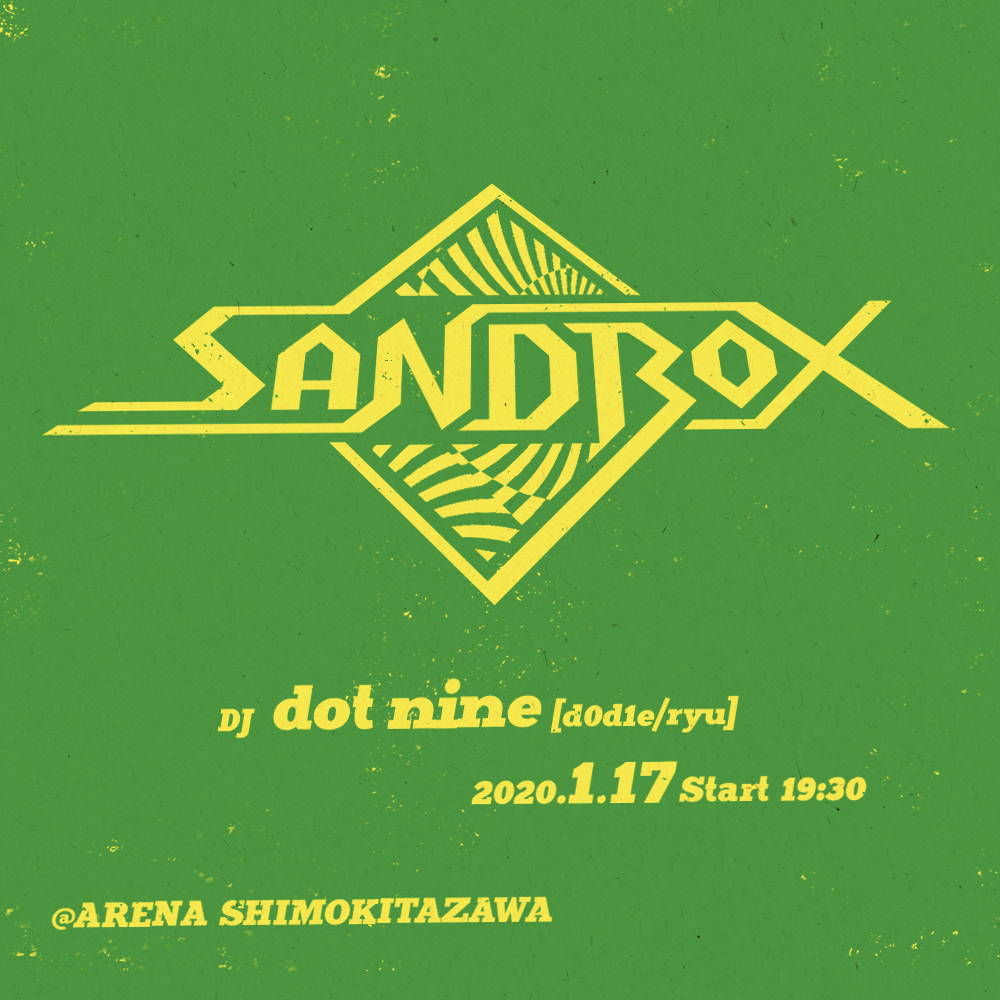

text by d0d1e

(このテキストは2019年12月に公開した、パーティ「Sandbox」についての説明テキストを加筆したものです。)

----

いつもDJやらさせてもらっている[ARENA下北沢](http://arena.nomouze.jp/)は、色々なイベント/やらさせてもらってますが、元々飲食店でもあり、サウンドシステムもダンス向けになってはいないので、クラブの機能性や実験性を重視したダンスに特化したプレイよりも、ラウンジ寄りの空間の中で、選曲のわかりやすさ、ポップさを重視する傾向のDJをよくやってました。ディスコハウスや和モノを多用するスタイルのDJが多かったです。

（ちなみに僕らは[Oh!Mountain](http://oh-mountain.xyz/#/)というパーティもARENA下北沢でやらさせてもらっていますが、こちらは「ダンスミュージックを鳴らしたい」思いがあり、自分たちでサウンドシステムを持ち込み強化して「ダンスミュージックの鳴り」が表現できるようにしています）

今回は、その選曲のリミット外して、僕らが必要以上に追い求め深堀りしている「ダンスミュージックの機能性」と「音楽が持つサイケデリック」にフォーカスを当てていくプレイを中心にやっていこうと思います。今まで自制してきたところを開放し、我々ならではの視点もたくさん盛り込み、他では聴けないであろうサウンドを鳴らしていきます。Cosmic~Balearic~Nu Disco~Acid House~Tech House~Minimalこの辺りがキーワードにはなるかと思います。

当初僕一人でやろうとも考えてましたが、20年来の友人、ツーカーの仲であるryu氏をレジデントDJとして参加してもらえることになったので、ユニット「dot nine」名義を久々に引っ張り出しました。ryu氏とは、しばらくの間活動を共には出来てなかったものの、タイミングが合えば一緒にDJをやり、DJをやらなくても音楽の話はずっとしていて、音楽の熱はお互い全く冷めやらないことは理解しあってました。ここらで二人の中で溜まったものを消化しつつ、アウトプットして新しいカタチにすべく、トライしていきたいなと考えてます。

これはryuさんが去年ロシアのポッドキャストに提供したミックスです。和モノも混ぜたBalearicフィールな好ミックスになってます。

<iframe width="100%" height="300" scrolling="no" frameborder="no" allow="autoplay" src="https://w.soundcloud.com/player/?url=https%3A//api.soundcloud.com/tracks/424238004&color=%23ff5500&auto_play=false&hide_related=false&show_comments=true&show_user=true&show_reposts=false&show_teaser=true&visual=true"></iframe>
<a href="https://soundcloud.com/zizkovdisko" title="Žižkov Disko" target="_blank" style="color: #cccccc; text-decoration: none;">Žižkov Disko</a> · <a href="https://soundcloud.com/zizkovdisko/mixtape-003-ryu" title="Mixtape 003 - by Ryu" target="_blank" style="color: #cccccc; text-decoration: none;">Mixtape 003 - by Ryu</a>

 

自分の方は、より「Groove」と言うものに着目し、大好きだったDaniel BellやRicardo Villalobosを意識しつつ、Deep HouseからRomanian Minimalへの流れを多用したTechnoとHouseのGrooveをキープし続ける最新型のHouseDJのプレイを掘り下げていきたいなと思ってます。

<iframe width="100%" height="300" scrolling="no" frameborder="no" allow="autoplay" src="https://w.soundcloud.com/player/?url=https%3A//api.soundcloud.com/tracks/747711013&color=%23ff5500&auto_play=false&hide_related=false&show_comments=true&show_user=true&show_reposts=false&show_teaser=true&visual=true"></iframe>
<a href="https://soundcloud.com/dj_d0d1e" title="d0d1e" target="_blank" style="color: #cccccc; text-decoration: none;">d0d1e</a> · <a href="https://soundcloud.com/dj_d0d1e/mixshow230120" title="d0d1e MixShow 23.01.20" target="_blank" style="color: #cccccc; text-decoration: none;">d0d1e MixShow 23.01.20</a>

 
こちらは2020年1月に公開したミックスです。

(ちなみに、Sandbox開始前は意識してなかったのですが、当初はCDJオンリーのプレイだったのが、Grooveを最重要視するあまり、Vinylでのプレイが全体の7−8割占めるようになりました)

下北沢は最近新しい箱が増えてきて、遊ぶ場所が増えて良い流れになってきますが、「ヤバい音」が鳴る空間は、まだまだあまりないと思うので、「音好き」のお客さんやDJを引き込められるように精進していきたいと思います。モダンでクールな音楽をあなたに。宜しくお願いします。

----

スタートして半年、ARENAのご協力もあり、雰囲気良い感じでやれるようになってきました。コロナによる中断もありましたが、その間も自分たちのやり方変えずブレずに掘り下げていきたと思います。クラブ行かない、僕ら掘り下げている音楽に興味が無い人ほど雰囲気を感じてもらいたいですね。お時間ありましたら是非来てください。ARENA自体良いお店だし、ゆったり過ごすに良いですよ。
